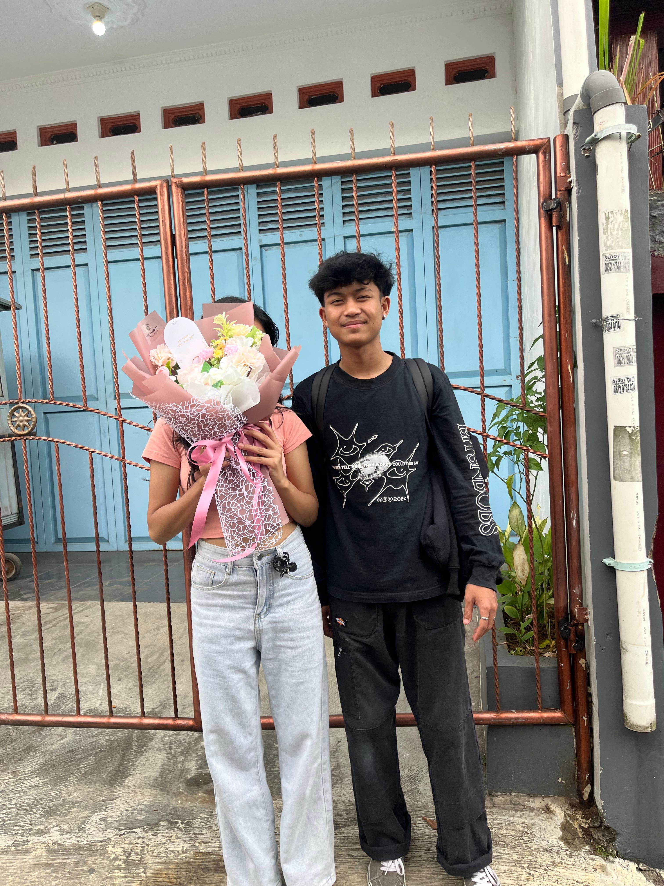

<html>
    <head>
        <title>buat crush</title>
        <link rel="stylesheet" href="lala.css" />
    </head>
    <body>
        

        <!--   NAVIGATION  -->
        

            <ul class="ul-navbar">
                <li class="li-navbar">
                    <a href="contact.html" class="a-navbar">open this</a>
                </li>
                <li class="li-navbar" >
                    <a href="about.html" class="a-navbar">clik ini</a>
                </li>
                <li class="li-navbar" >
                    <a href="hari.html" class="a-navbar">open last</a>
                </li>
            </ul>
        

        <!--  NAVIGATION BAR SELESAI  -->
<html>            
html {
    margin: 0;
    padding: 0%;
}

.container-navbar {
    background-color: palegoldenrod;
    width: 100%;
    height: 19vh;
} 

.ul-navbar {  
    display: flex;
    height: 100px;
    justify-content: center;
    align-items: center;
}

.li-navbar {
    list-style-type: none;
    padding: 20px;
    margin: 5px;
    color: white;
    font-size: 30px;
}

.li-navbar:hover {
    background-color: palevioletred;
    transition: .5s ease-in-out;
    transition-delay: .3s;
}

.a-navbar {
    color:aliceblue;
    text-decoration: none;
}

.container-content {
    background-color: pink;
    display: flex;
    justify-content: center;
    align-items: center;
    height: 70vh;
}

.img-content {
    width: 27%;
    height: 99%;
}

.container-footer {
    height: 11vh;
    background-color: palegoldenrod;
    display: flex;
    justify-content: center;
    align-items: center;
}
</html>
.h1-footer {
    font-size: 40px;
    color: white;
}
        <!--  CONTENT 1  -->
        

            
        

        <!--  CONTENT 1  -->

        <!--  FOOTER  -->
        

            <h1 class="h1-footer">makasih ya lala udh mau buka website ini</h1>
        

        <!--  FOOTER END  -->
        

    </body>
</html>
<html>
    <head>
        <title>clik ini</title>
    </head>
    <body>
        <h1> you are a very beautiful girl</h1>
    </body>
</html>
<html>
    <head>
        <title>open this</title>
    </head>
    <body>
        <h1>halo lala</h1>
    </body>
</html>
<html>
    <head>
        <title>open last</title>
    </head>
    <body>
        <h1>hai lala, how are you? maaf ya aku sering nge chat in kamu kalo lagi</h1>
        <h2>kangen banget oh ya sekali lagi semangat terus sekolah nya semoga</h2>
        <h3>cita-cita kamu pengenin tercapai i loved you</h3>
    </body>
</html>

<html>
    <head>
        <title>buat crush</title>
        <link rel="stylesheet" href="lala.css" />
    </head>
    <body>
        

        <!--   NAVIGATION  -->
        

            <ul class="ul-navbar">
                <li class="li-navbar">
                    <a href="contact.html" class="a-navbar">open this</a>
                </li>
                <li class="li-navbar" >
                    <a href="about.html" class="a-navbar">clik ini</a>
                </li>
                <li class="li-navbar" >
                    <a href="hari.html" class="a-navbar">open last</a>
                </li>
            </ul>
        

        <!--  NAVIGATION BAR SELESAI  -->

        <!--  CONTENT 1  -->
        

            
        

        <!--  CONTENT 1  -->

        <!--  FOOTER  -->
        

            <h1 class="h1-footer">makasih ya lala udh mau buka website ini</h1>
        

        <!--  FOOTER END  -->
        

    </body>
</html>
*,
html {
    margin: 0;
    padding: 0%;
}

.container-navbar {
    background-color: palegoldenrod;
    width: 100%;
    height: 19vh;
} 

.ul-navbar {  
    display: flex;
    height: 100px;
    justify-content: center;
    align-items: center;
}

.li-navbar {
    list-style-type: none;
    padding: 20px;
    margin: 5px;
    color: white;
    font-size: 30px;
}

.li-navbar:hover {
    background-color: palevioletred;
    transition: .5s ease-in-out;
    transition-delay: .3s;
}

.a-navbar {
    color:aliceblue;
    text-decoration: none;
}

.container-content {
    background-color: pink;
    display: flex;
    justify-content: center;
    align-items: center;
    height: 70vh;
}

.img-content {
    width: 27%;
    height: 99%;
}

.container-footer {
    height: 11vh;
    background-color: palegoldenrod;
    display: flex;
    justify-content: center;
    align-items: center;
}

.h1-footer {
    font-size: 40px;
    color: white;
}
<html>
    <head>
        <title>clik ini</title>
    </head>
    <body>
        <h1> you are a very beautiful girl</h1>
    </body>
</html>
<html>
    <head>
        <title>open this</title>
    </head>
    <body>
        <h1>halo lala</h1>
    </body>
</html>

